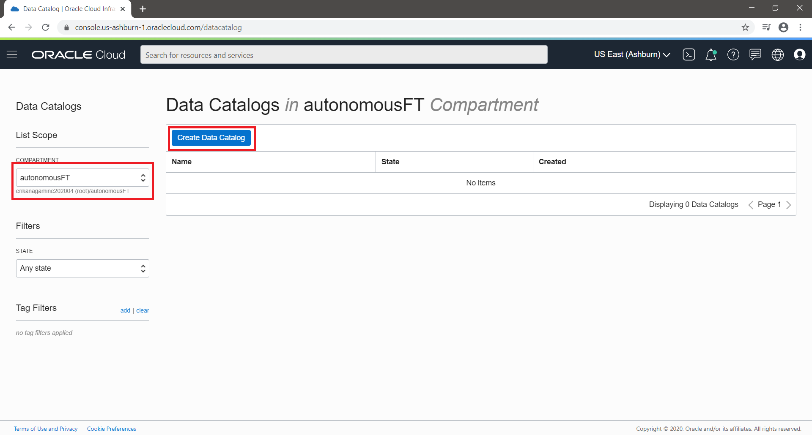
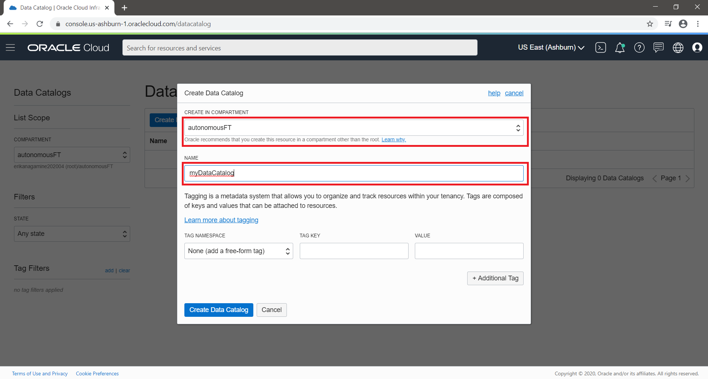
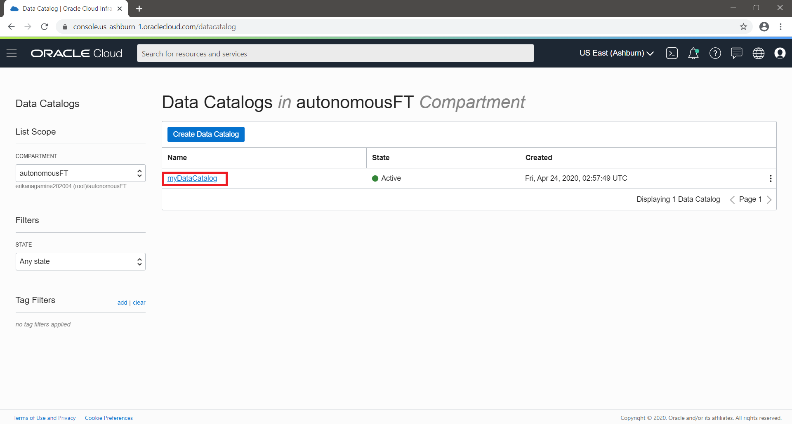
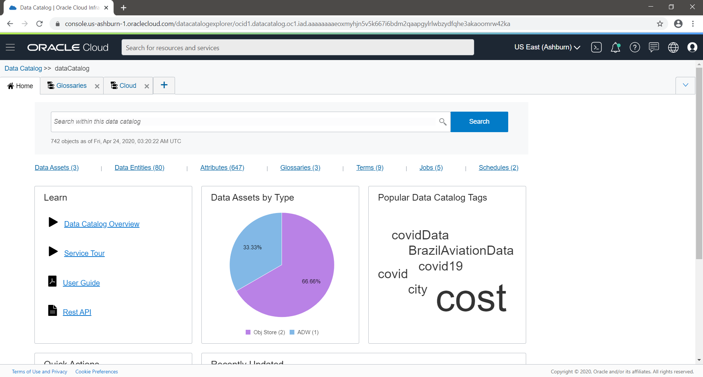

    #     ___  ____     _    ____ _     _____
    #    / _ \|  _ \   / \  / ___| |   | ____|
    #   | | | | |_) | / _ \| |   | |   |  _|
    #   | |_| |  _ < / ___ | |___| |___| |___
    #    \___/|_| \_/_/   \_\____|_____|_____|
***

# OCI Data Catalog

Oracle Cloud Infrastructure Data Catalog is an metadata platform that helps you on manage metadata on many silos of data.

In this cloud service, we can manage diffents silos and discover data using an organized inventory of data assets across your cloud account.

With this self-service solution, data consumers can easily find, understand, govern, and track Oracle Cloud data assets.

# 1. Before Instantiate Data Catalog
   You need to give the right permissions to your cloud tenant. You can check [here](https://docs.cloud.oracle.com/en-us/iaas/data-catalog/using/policies.htm#policies "Oracle Official Documentation").

   To create a policy, please go to menu -> identity -> policy

   In terms of tests, we will give all permission to tenancy, but as a best practice, you should check the right permission:
   
   >> allow service datacatalog to read object-family in tenancy

2. Create Data Catalog
   To instantiate a data catalog service, you should go to menu -> Data and AI -> Data Catalog.

   Choose your prefered compartment and click in "Create Data Catalog".

   

   On the creation screen, you need to choose the compartment and the name of this service and click in "Create Data Catalog".
   
   

   PS. You can add a tag on the service if you want to create a budget segregated report.

   After creating your service, you should click the service created on the page:

   

3. Navigate into the console
   
   After access the main page of Data Catalog service, you can check your assets by type or tags.

   

   At this moment you need to create

4. Create a new asset

To harvest your data source, you need to register your data source as a data asset in your data catalog instance. A data asset is any physical data store or stream of data such as a database, a cloud storage container, or a message stream.

# Supported Data Sources
You use the following Oracle Cloud Infrastructure data sources to create data assets in :

- Object Storage
- Oracle Database
- MySQL
- Apache Hive installed on Oracle Cloud Infrastructure
- Kafka streams installed on Oracle Cloud Infrastructure

Depending on the type of data asset you create, you use different data structures to browse the data entities. For example, if you create an Oracle Database data asset, you browse through database objects to review the table and view data entities.

# Supported File Types
The following file types are supported for Oracle Object Storage:

- Comma Separated Value (CSV) files (.csv, .csv.gv)
- XML files (.xml, .xsd)
- AVRO files (.avro, .avro.gz)
- Excel files (.xls, .xlsx)
- Apache Parquet files (.parquet, .pq)
- Apache ORC files (.orc)
- Simple JSON files (.json, .json.gz)

# What are Data Entities and Attributes
A data asset contains one or more data entities. A data entity is a collection of data such as a database table or view, or a single logical file. A data entity normally has many attributes that describe its data. An attribute describes a data item with a name and data type.

|Data Asset |	Data Entities	|Attributes|
|----------|------------------|----------|
|Database	|Tables and Views	| Columns|
|File | Container	Files | Fields|
|Data |Stream	Event or Topic or Payload |	Keys|

1. Harvesting
2. Create a glossary
3. Create

Links:
[Official documentation](https://docs.cloud.oracle.com/en-us/iaas/data-catalog/using/policies.htm#policies "Oracle Official Documentation").
[White paper](https://www.oracle.com/a/ocom/docs/oci-data-catalog-data-sheet.pdf "Oracle Official Documentation").

